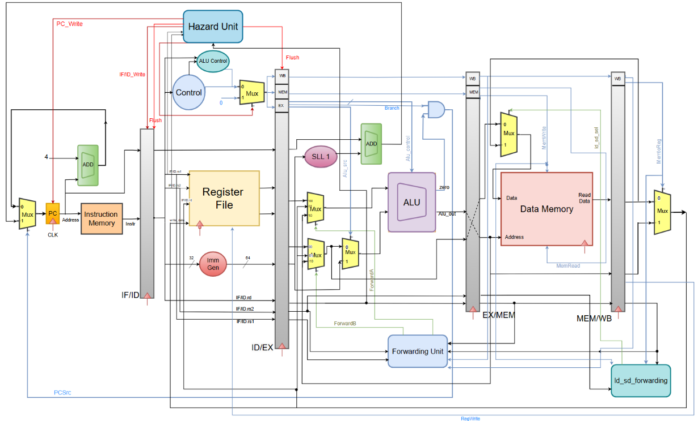

# RISC-V Pipelined Processor (RV64I)

A 5-stage pipelined RISC-V processor implemented in Verilog, based on the RV64I instruction set architecture, featuring a Hazard Detection Unit, Data Forwarding Unit, and a 2-bit Branch History Table (BHT).

## Key Features
- 5-stage pipelined RV64I processor (IF, ID, EX, MEM, WB)
- Full hazard handling: forwarding, load-use stalls, branch flush
- **Dynamic branch prediction using a 2-bit saturating counter BHT (16 entries)**
- Special ld-after-sd forwarding path
- Fully modular Verilog design with unit testbenches for each module
- Verified using loop-heavy Fibonacci benchmark

## Table of Contents

- [Overview](#overview)
- [Datapath Architecture](#datapath-architecture)
- [Pipeline Stages](#pipeline-stages)
- [Hazard Handling](#hazard-handling)
- [Supported Instructions](#supported-instructions)
- [Module Descriptions](#module-descriptions)
- [Project Structure](#project-structure)
- [Getting Started](#getting-started)
- [Testing & Results](#testing--results)
- [Conclusion](#conclusion)

---

## Overview

This project presents the design and implementation of a **5-stage pipelined RISC-V processor** based on the RV64I instruction set. The processor is implemented in **Verilog** and simulated using **iVerilog**.

Key characteristics:

- Executes instructions across **5 pipeline stages**: IF, ID, EX, MEM, WB
- Features a **Hazard Detection Unit** to handle load-use data hazards via pipeline stalls and branch flushes
- Features a **Forwarding Unit** to resolve RAW data hazards without unnecessary stalls wherever possible
- Features a **`ld`-after-`sd` Forwarding Unit** for the special case of a store immediately following a load to the same register
- The **Register File** includes write-forwarding: if WB writes and ID reads the same register in the same cycle, the new value is forwarded immediately
- A **2-bit Branch History Table (BHT)** is included inside the Hazard Detection Unit for future branch prediction use
- **Pipeline registers** (IF/ID, ID/EX, EX/MEM, MEM/WB) hold intermediate values between stages
- Fully modular design — each datapath component is an independent Verilog module
- All modules operate **synchronously** with the clock signal

---

## Datapath Architecture

The complete datapath of the pipelined processor is shown below:



The datapath implements the classic 5-stage RISC-V pipeline:

1. **IF (Instruction Fetch)** — PC provides the address; Instruction Memory returns the 32-bit instruction; PC+4 is computed for the next cycle
2. **ID (Instruction Decode)** — Control Unit decodes the opcode; Register File reads source operands (with WB write-forwarding); Immediate Generator sign-extends the immediate field
3. **EX (Execute)** — ALU performs the required operation; Forwarding Unit selects the correct operands; branch outcome and target address are computed
4. **MEM (Memory Access)** — Data Memory performs load or store if required; ld-after-sd forwarding applied to store data
5. **WB (Write-Back)** — Result is written back to the destination register

---

## Pipeline Stages

| Stage | Pipeline Register | Key Operations |
|-------|------------------|----------------|
| IF    | IF/ID            | Instruction fetch, PC+4 |
| ID    | ID/EX            | Register read, control signal generation, immediate generation |
| EX    | EX/MEM           | ALU operation, forwarding selection, branch outcome |
| MEM   | MEM/WB           | Data memory read/write, ld-after-sd forwarding |
| WB    | —                | Write result to register file |

---

## Hazard Handling

### Data Hazards — Forwarding Unit

The **Forwarding Unit** detects when a register being read in the EX stage was written by an instruction still in the EX/MEM or MEM/WB pipeline stage. It forwards the correct value directly to the ALU inputs, eliminating most data hazard stalls.

| Condition | Forward Source | ForwardA / ForwardB |
|-----------|---------------|---------------------|
| EX/MEM.rd == ID/EX.rs | EX/MEM ALU result | `2'b10` |
| MEM/WB.rd == ID/EX.rs | MEM/WB write data | `2'b01` |
| No hazard | Register File output | `2'b00` |

### Load-Use Hazard — Hazard Detection Unit

When a `ld` instruction is immediately followed by an instruction that uses the loaded register, the pipeline is stalled for one cycle by:
- Inserting a **control bubble (NOP)** into the ID/EX pipeline register
- **Freezing** the PC and IF/ID pipeline register for one cycle (`pc_write = 0`, `if_id_write = 0`)

### Branch Hazard — Flush

Branches are resolved at the end of the EX stage. When a branch is taken, the two instructions that entered IF and ID incorrectly are squashed by flushing the IF/ID and ID/EX pipeline registers (`flush = 1`).

### ld-after-sd Forwarding

A bonus forwarding path handles the case where a `sd` instruction immediately follows a `ld` that writes to the same register as the store data source. The loaded value from the MEM/WB stage is forwarded directly to the Data Memory write port via a mux.

<!-- ### 2-bit Branch History Table (BHT)

A 16-entry 2-bit saturating counter BHT is included in the Hazard Detection Unit, indexed by bits `[5:2]` of the branch PC. Records branch outcomes each cycle; the `predicted_taken` output is available for future integration into a full branch predictor. -->


### Dynamic Branch Prediction (2-bit BHT)
A 16-entry Branch History Table (BHT) using 2-bit saturating counters is implemented and indexed using PC[5:2].
- Predicts branch direction based on past behavior
- Updated on every branch resolution
- Reduces control hazard penalties in loop-heavy workloads

---

## Supported Instructions

| Format | Instructions |
|--------|-------------|
| R-type | `add`, `sub`, `and`, `or` |
| I-type | `addi` |
| Load   | `ld` |
| Store  | `sd` |
| Branch | `beq` |

---

## Module Descriptions

The processor is built from the following independently designed and verified modules:

### 1. Program Counter (`pc.v`)

- 64-bit register storing the address of the current instruction
- Updates on every rising clock edge only when `pc_write` is asserted (stall control from HDU)
- Resets to `0x0000...0000` on reset

### 2. Register File (`register_file.v`)

- 32 × 64-bit general-purpose registers (RV64I architecture)
- 2 combinational read ports, 1 synchronous write port
- Register `x0` is hardwired to zero and cannot be written
- **Write-forwarding**: if WB writes and ID reads the same non-zero register in the same cycle, the new value is forwarded combinationally to avoid a 1-cycle stale read

### 3. Instruction Memory (`Instruction_Memory.v`)

- Read-only memory, 4096 bytes, byte-addressed
- Loads instructions from `instructions.txt` at initialization
- Outputs a 32-bit instruction in **Big-Endian** format

### 4. Control Unit (`control.v`)

- Decodes the 7-bit opcode and generates all datapath control signals
- Combinational logic — outputs update immediately on opcode change
- Control signals are passed through pipeline registers (ID/EX → EX/MEM → MEM/WB)

| Instruction | ALUSrc | MemToReg | RegWrite | MemRead | MemWrite | Branch | ALUOp |
|-------------|--------|----------|----------|---------|----------|--------|-------|
| R-format    | 0      | 0        | 1        | 0       | 0        | 0      | 10    |
| `addi`      | 1      | 0        | 1        | 0       | 0        | 0      | 00    |
| `ld`        | 1      | 1        | 1        | 1       | 0        | 0      | 00    |
| `sd`        | 1      | X        | 0        | 0       | 1        | 0      | 00    |
| `beq`       | 0      | X        | 0        | 0       | 0        | 1      | 01    |

### 5. Immediate Generator (`Immediate_Generation.v`)

- Extracts and **sign-extends** immediate fields to 64 bits
- Supports I-type, load, S-type, and B-type instruction formats
- B-type immediate already encodes the byte offset (LSB=0 appended) — no extra shift needed in the branch adder

### 6. ALU Control (`alu_control.v`)

- Generates a 4-bit control signal for the ALU based on `ALUOp` and `funct3`/`funct7` fields

| ALUOp | Operation | ALU Control |
|-------|-----------|-------------|
| 00    | ADD (for `ld`/`sd`/`addi`) | 0010 |
| 01    | SUB (for `beq`)             | 0110 |
| 10    | R-type (decoded from funct bits) | varies |

### 7. 64-bit ALU (`alu_64_bit`)

- Performs ADD, SUB, AND, OR on 64-bit operands using structural gate-level submodules (`add64`, `sub64`, `and64`, `or64`)
- Outputs a **zero flag** used for branch decisions
- Receives operands through the Forwarding Unit's 3:1 mux outputs

### 8. Data Memory (`Data_Memory.v`)

- 1024 bytes of byte-addressable storage
- Supports 64-bit load (`ld`) and store (`sd`) in **Big-Endian** format
- Synchronous writes on rising clock edge; combinational reads

### 9. Hazard Detection Unit (`hazard_detection_unit`)

- Detects **load-use hazards**: stalls the pipeline for one cycle when a `ld` result is needed by the immediately following instruction
- Detects **taken branches**: asserts `flush = 1` to squash incorrectly fetched instructions from IF and ID
- Contains a **16-entry 2-bit saturating counter BHT** for branch history recording

### 10. Forwarding Unit (`Forwarding_unit`)

- Compares destination registers in EX/MEM and MEM/WB with source registers in EX
- Outputs `ForwardA[1:0]` and `ForwardB[1:0]` to select among register file, EX/MEM, or MEM/WB values
- Handles double data hazard: EX/MEM forwarding takes priority over MEM/WB

### 11. ld-after-sd Forwarding Unit (`ld_after_sd_forwarding`)

- Detects when MEM/WB holds a loaded value and EX/MEM has a store to the same source register
- Forwards the loaded value to the Data Memory write port via a mux, bypassing the stale pipeline register value

### 12. Control Bubble (`control_bubble`)

- NOP mux: when `sel = 1` (load-use stall), zeroes out all control signals entering the ID/EX pipeline register, preventing unintended writes or memory accesses

### 13. Pipeline Registers

Four sets of pipeline registers pass state between stages:

| Register | Key Fields Passed Forward |
|----------|--------------------------|
| IF/ID    | PC, 32-bit instruction |
| ID/EX    | Control signals, register values, immediate, rs1/rs2/rd |
| EX/MEM   | Control signals, ALU result, store data, rs2, rd |
| MEM/WB   | Control signals, memory read data, ALU result, rd |

### 14. 2:1 Multiplexers (`mux2_1.v`)

- Selects between two 64-bit inputs; used for ALUSrc, PC source (branch vs PC+4), WB data, and ld-after-sd store data

### 15. 64-bit Adder (`adder64.v`)

- Combinational adder; one instance for PC+4 and another for branch target (EX-stage PC + B-type immediate)

---

## Project Structure

```
riscv-pipeline-simulator/
├── Datapath_Architecture/
│   └── Datapath_Architecture_pipe.png
├── PIPE_grading/
│   └── PIPE_grading/
├── Report/
│   └── IPA_Pipelined_Project_Report.pdf
├── modules/
│   ├── adder64.v
│   ├── alu.v
│   ├── alu_control.v
│   ├── control.v
│   ├── Data_Memory.v
│   ├── forwarding_unit.v
│   ├── hazard_detection.v
│   ├── Immediate_Generation.v
│   ├── Instruction_Memory.v
│   ├── mux2_1.v
│   ├── pc.v
│   └── register_file.v
├── modules_tb/
│   ├── adder64_tb.v
│   ├── alu_control_tb.v
│   ├── alu_tb.v
│   ├── control_tb.v
│   ├── Data_Memory_tb.v
│   ├── forwarding_unit_tb.v
│   ├── hazard_detection_tb.v
│   ├── Immediate_Generation_tb.v
│   ├── Instruction_Memory_tb.v
│   ├── mux2_1_tb.v
│   ├── pc_tb.v
│   └── register_file_tb.v
├── Fibonacci_ins.txt
├── Fibonacci_ins_exp.txt
├── Fibonacci_register_file.txt
├── IPA_Pipelined_Project_Doc.pdf
├── instructions.txt
├── instructions_exp.txt
├── pipe.v
├── pipe_tb.v
├── README.md
└── register_file.txt
```

---


## Testing & Results

### Fibonacci Sequence Test

The processor was validated by computing the **10th Fibonacci number** using a loop and branch instructions, exercising the forwarding unit across multiple loop iterations and triggering branch flushes on every taken back-edge branch.

**Assembly Program:**

```asm
addi x1, x0, 10      # Initialize loop counter n = 10
addi x2, x0, 0       # a = 0
addi x3, x0, 1       # b = 1
addi x1, x1, -1      # n = n - 1
beq  x1, x0, 20      # If n == 0, exit loop
add  x4, x2, x3      # temp = a + b
addi x2, x3, 0       # a = b
addi x3, x4, 0       # b = temp
beq  x0, x0, -20     # Unconditional branch back to loop
```

**Simulation Output:**

```
Total cycles: 84

x0  = 0000000000000000   (0)
x1  = 0000000000000000   (0)   ← loop counter exhausted
x2  = 0000000000000022   (34)  ← 9th Fibonacci number
x3  = 0000000000000037   (55)  ← 10th Fibonacci number
x4  = 0000000000000037   (55)  ← last computed value
x5–x31 = 0000000000000000
```

The result confirms correct pipelined execution. The 84-cycle count reflects the 9 instructions × 10 iterations plus pipeline fill/drain cycles and the 2-cycle branch-flush penalty on each taken back-edge branch.

---

## Conclusion

A 5-stage pipelined RISC-V processor (RV64I) was successfully designed, implemented in Verilog, and verified through simulation. The pipeline includes a fully functional Hazard Detection Unit for load-use stalls and branch flushes, a Forwarding Unit for resolving RAW hazards, an ld-after-sd forwarding path, and register-file write-forwarding — all working together to maximise correct execution with minimal stalls. All datapath and hazard-handling modules were developed independently, tested with dedicated testbenches, and integrated into a complete working processor. The design correctly executes arithmetic, logical, memory, and branch instructions, as validated by the Fibonacci benchmark.

---

> **Related Project:** [RISC-V Sequential Simulator](https://github.com/poojith06/riscv-sequential-simulator) — the non-pipelined single-cycle version of this processor.
